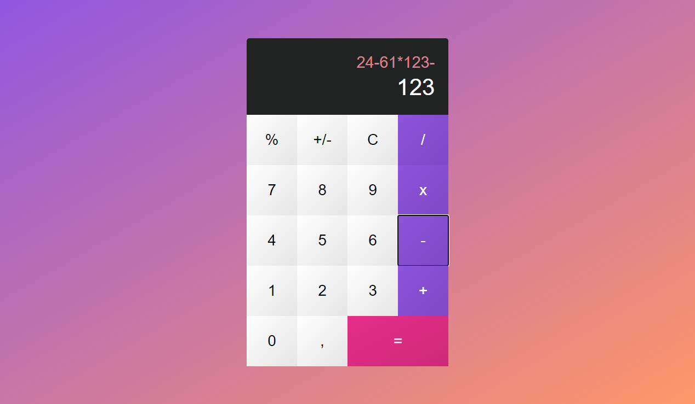

# Calculator

This is a HTML/CSS/JavaScript calculator app based on PSD project. 
[Link to PSD](https://creativetacos.com/free-calculator-psd/)

## Run project

To open project just download it or pull this project and just open `index.html` file.

### Or

Check it on [LIVE PREVIEW]() in your browser.

## Project usage

To use calculator you can press buttons on virtual keyboard or using your own keyboard (I prefer number keyboard keys).

`C` button clear your calculator equation to 0.  
`+/-` button surrounds the entered number with parentheses and sets its sign `-`
> Example: 
Input: 5 [+/-] [+] 8 [+] 12.2 [+/-] [+] 1.8 [+/-] [+] 4 [=] 
Resault: (-5) + 8 + (-12.2) + (-1.8) + 4

`=` button is count your current equation, then final value is added as a only one value (previous equation is cleared). This allow you to continue input values with a previous result.

## Note for developer

- Real time equation end resault display
- Prevent from input multiple signs [`, or .`, `/`, `*`, `+`, `-`, `%`]
- Add small border radius on bottom left and right corner

## Author
- Marcel Moś - Developer

Project based on: [Link to PSD](https://creativetacos.com/free-calculator-psd/)